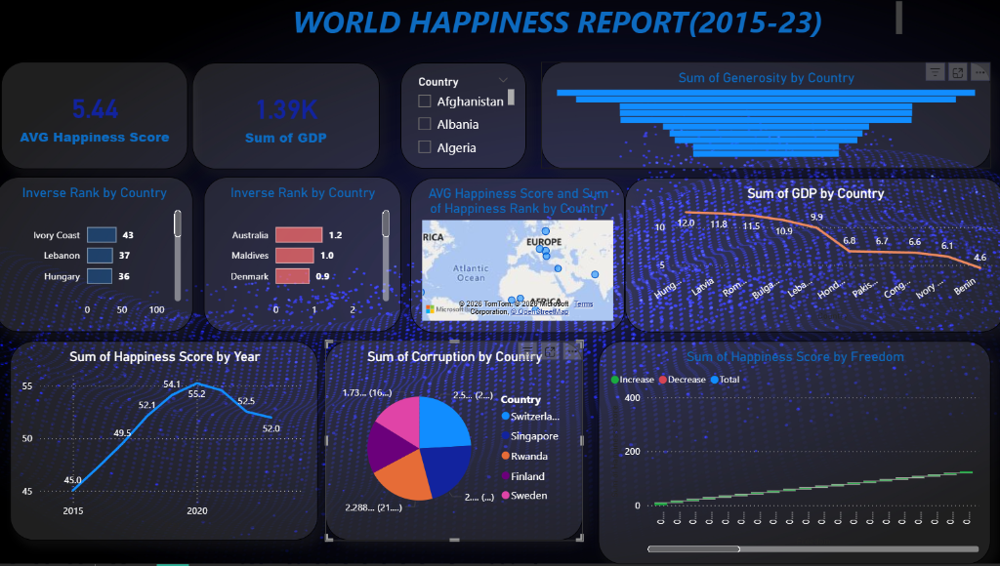

# 🌍 World Happiness Report

A Power BI dashboard analyzing the World Happiness Report data, exploring key factors that contribute to happiness across countries and regions.

## 📊 Dashboard

This project contains an interactive Power BI report (`World Happiness Report.pbix`) that visualizes happiness scores and their contributing factors worldwide.

## 🔑 Key Metrics Explored

- **Happiness Score** — Overall happiness ranking by country
- **GDP per Capita** — Economic output and its correlation with happiness
- **Social Support** — Impact of social networks and community
- **Life Expectancy** — Health and well-being indicators
- **Freedom** — Freedom to make life choices
- **Generosity** — Charitable giving patterns
- **Perceptions of Corruption** — Trust in government and business

## 🛠️ Tools Used

- **Power BI Desktop** — Data visualization and dashboard creation

## 📁 Files

| File | Description |
|------|-------------|
| `World Happiness Report.pbix` | Power BI dashboard file |

## 🚀 How to Use

1. Download the `.pbix` file
2. Open it with [Power BI Desktop](https://powerbi.microsoft.com/desktop/)
3. Explore the interactive visualizations

## 📜 License

This project is open source and available under the [MIT License](LICENSE).
